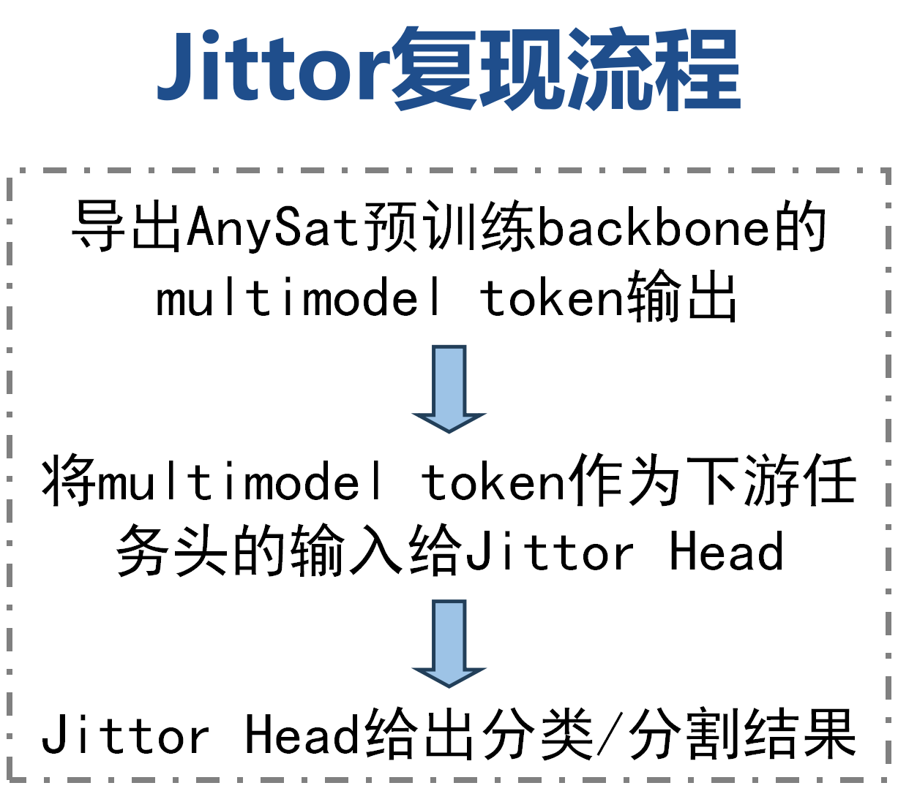
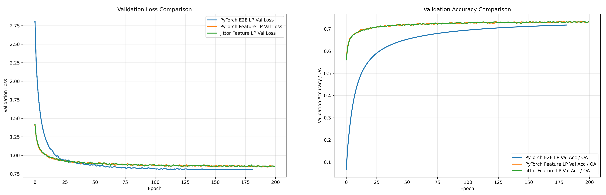
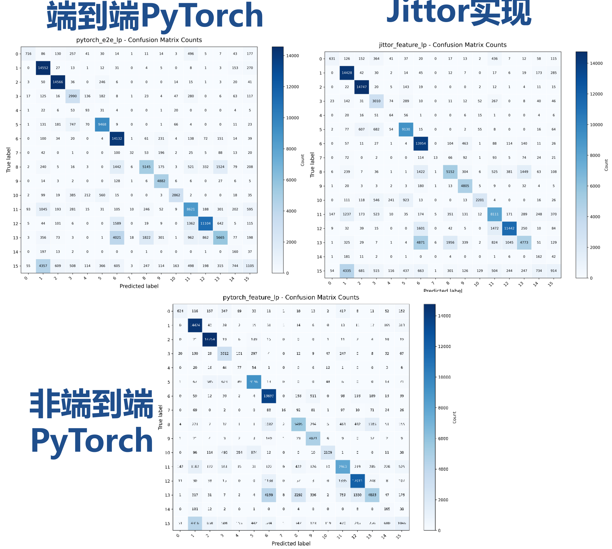
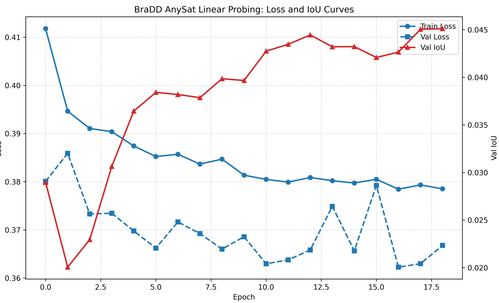
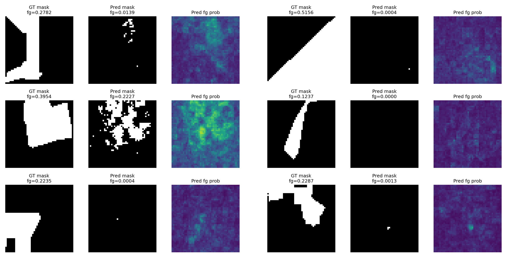

# AnySat-Jittor

本项目是基于遥感多模态基础模型 AnySat: One Earth Observation Model for Many Resolutions, Scales, and Modalities 的 Jittor 框架迁移与下游任务复现实验。项目主要围绕遥感多模态大模型的下游适配展开，重点实现了基于 AnySat 冻结特征的 TimeSen2Crop 作物类型分类线性探测，并对 BraDD-S1TS 森林砍伐检测 / 语义分割任务进行了复现、可视化和结果分析。

---

## 项目背景

遥感数据天然具有多源异构特点，包括：
* 不同传感器模态：如 Sentinel-1 SAR、Sentinel-2 光学时间序列、高分航空影像等；
* 不同空间分辨率：如米级、十米级甚至更粗分辨率；
* 不同时间维度：单时相影像和多时相时间序列；
* 不同下游任务：分类、语义分割、变化检测等。

AnySat 的核心目标是构建一个能够适配多分辨率、多尺度、多模态遥感数据的统一基础模型。本项目在此基础上，主要关注两个问题：
1. 如何将 AnySat 预训练 backbone 的特征用于 Jittor 框架下的下游任务。
2. 如何在有限存储和算力条件下，选择合适的外部数据集进行复现和效果评估。

---

## 整体复现路线

由于 AnySat 预训练数据规模庞大，本项目没有重新进行端到端预训练，而是采用更适合框架迁移的路线：

1. 特征提取：利用 AnySat 预训练 backbone 导出下游数据集的 multimodal token，并保存为 .npz 文件。
2. Jittor 迁移：使用 Jittor 框架实现轻量的下游分类 / 分割头。
3. 模型评估：在 TimeSen2Crop 上进行线性探测实验；在 BraDD-S1TS 上进行语义分割复现，输出指标、混淆矩阵与可视化结果。

---

## 项目结构

AnySat-Jittor/
├── .media/                         # README 用到的图片资源
├── configs/                        # 实验配置文件
├── src/
│   ├── data/                       # 数据读取和处理
│   ├── jittor_lp/                  # Jittor 线性探测实现
│   ├── models/                     # 模型结构、损失函数与评估指标
│   ├── utils/                      # 工具函数
│   ├── visualization/              # 可视化脚本 (混淆矩阵, loss 曲线, 预测结果)
│   ├── eval.py                     # 评估入口
│   ├── train.py                    # 训练入口
│   └── train.sh                    # 训练脚本示例
├── vis_bradd_preds/                # BraDD 预测结果可视化目录
├── demo.ipynb                      # 示例 Notebook
├── requirements.txt                # 依赖清单
└── README.md

---

## 数据集说明

本仓库不直接分发原始数据集。请根据官方链接自行下载，并按 data/README.md 的说明放置到本地。

数据集：TimeSen2Crop
任务类型：作物类型分类
传感器/模态：Sentinel-2 光学时间序列
类别数：16
数据规模：~14.9 GB
官方链接：https://zenodo.org/records/4715631 或 https://huggingface.co/datasets/monster-monash/TimeSen2Crop

数据集：BraDD-S1TS
任务类型：森林砍伐 / 语义分割
传感器/模态：Sentinel-1 SAR 时间序列
类别数：2 (变化/背景)
数据规模：~17.7 GB
官方链接：https://zenodo.org/records/8060250 或 https://github.com/ecovision-uzh/BraDD-S1TS

建议本地数据存放路径推荐分别为 data/TimeSen2Crop/ 和 data/BraDD-S1TS/。

---

## 环境配置与安装

### 1. 基础依赖

推荐使用 Python 3.9 环境：

conda create -n anysat_jittor python=3.9
conda activate anysat_jittor
pip install -r requirements.txt
pip install jittor

### 2. Git LFS 与大文件管理

本项目使用 Git LFS 管理 .npz 特征和模型权重。克隆仓库前请务必安装：

git lfs install
git clone git@github.com:mortal-0/AnySat-Jittor.git
cd AnySat-Jittor
git lfs pull

注意：若部分特征文件（如 train_features_npz.7z.001）被拆分为 7-Zip 分卷，请使用 "7z x train_features_npz.7z.001" 命令手动合并恢复。

### 3. Jittor 算子异常检查

部分 CUDA 环境下 Jittor 算子可能出现异常，导致 loss 失真。建议在训练前运行最小检查脚本：

python src/jittor_lp/debug_jittor_ops.py

正常结果中，16 类全零 logits 的交叉熵应接近理论值（约 2.77）。若出现 0 或极大值，请使用 CPU 模式运行 (--use_cuda 0) 或清理 Jittor 缓存：python -m jittor_utils.clean_cache all。

---

## 实验结果与分析

### 1. TimeSen2Crop 作物类型分类 (线性探测)

Jittor 下游采用 LayerNorm(D) + Linear(D, num_classes) 的轻量探测结构。

运行命令：
python src/jittor_lp/train_ts2c_head_jittor.py \
  --train_npz src/jittor_lp/outputs/ts2c_features/train_features.npz \
  --val_npz src/jittor_lp/outputs/ts2c_features/val_features.npz \
  --test_npz src/jittor_lp/outputs/ts2c_features/test_features.npz \
  --batch_size 1024 \
  --epochs 200 \
  --lr 2e-4 \
  --use_cuda 1

测试集准确率对比：
End-to-End PyTorch: 72.02%
Jittor Feature LP (Ours): 70.76%
PyTorch Feature LP: 70.66%

基于冻结 AnySat 特征的 Jittor 线性探测结果与 PyTorch 非常接近，验证了框架迁移的有效性。

### 2. BraDD-S1TS 语义分割复现

BraDD 任务对空间结构和类别不平衡更加敏感。通过绘制 Loss / IoU 曲线并可视化预测结果发现：
* 现象 1：训练集 Loss 持续下降，但验证集 IoU 提升有限，泛化存在波动。
* 现象 2：模型易偏向背景类（类别极度不平衡导致）。
* 现象 3：仅依赖线性探测难以完美恢复复杂边界。后续建议引入更强的分割头或调整类别加权损失。

---

## 已知问题与踩坑记录

1. BraDD 指标维度不匹配报错：在计算 IoU 时，若遇到 [B*H*W, C] 与 [B, H, W, C] 不匹配，需确保预测结果先执行 argmax 获取 [B, H, W] 的索引标签，再统一做 one-hot 与维度重排。
2. Jittor Loss 停滞：如前述，若 Loss 恒定为 0 或 1，一定是底层算子在当前 CUDA 环境中编译异常，切勿浪费时间修改训练逻辑，优先排查环境或使用 CPU 跑通逻辑。

---

## 参考文献

* AnySat: One Earth Observation Model for Many Resolutions, Scales, and Modalities (CVPR 2025)
* TimeSen2Crop: A Million Labeled Samples Dataset of Sentinel 2 Image Time Series for Crop-Type Classification (IEEE JSTARS 2021)
* Deforestation Detection in the Amazon with Sentinel-1 SAR Image Time Series (ISPRS 2023)

## License

本项目遵循 MIT License。感谢 AnySat 原作者提供的基础模型开源代码，以及 TimeSen2Crop 和 BraDD-S1TS 数据集作者的贡献。
